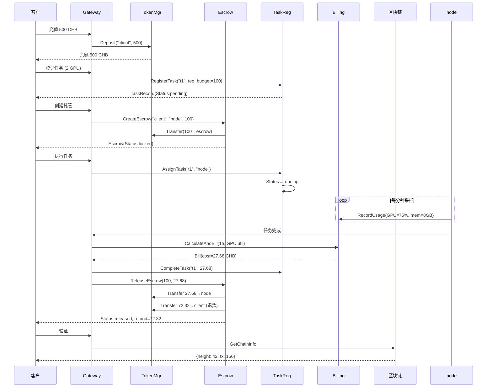

# ComputeHub 完整架构 (Sprint 4 完成状态)

**Go 代码**: 7,484 行 | **测试**: 56+ 个 | **包**: 9 个 | **API 端点**: 40+

---



```mermaid
graph TB
    subgraph "入口层 Entry"
        CLI["main.go<br/>CLI入口"]
        TUI["tui.go<br/>Terminal UI"]
        TUI_BIN["computehub-tui<br/>(8.3 MB 二进制)"]
    end

    subgraph "API网关 Gateway"
        GW["Gateway<br/>HTTP Server :8282"]
        GW_END["/api/health<br/>/api/status<br/>/api/dispatch<br/>/api/jobs<br/>/api/nodes<br/>/api/node/*"]
        BC_END["/api/blockchain/*<br/>(25 端点)"]
        WEB_END["/web/dashboard<br/>/web/api/metrics"]
    end

    subgraph "确定性内核 Kernel"
        K["Kernel<br/>队列+状态机"]
        K_ACT["Actions:<br/>SUBMIT<br/>EXECUTE<br/>MONITOR<br/>CANCEL<br/>STATUS"]
        K_QC["配额管理<br/>buffer=500<br/>max_states=5000"]
    end

    subgraph "纯化流水线 Pipeline"
        P["Purification<br/>(4级过滤)"]
        P1["Syntax<br/>语法检查"]
        P2["Semantic<br/>语义验证"]
        P3["Boundary<br/>边界检查"]
        P4["Context<br/>上下文审查"]
    end

    subgraph "执行引擎 Executor"
        EX["Executor<br/>沙盒执行"]
        EX_SANDBOX["Docker/cgroup/shell<br/>梯度降级"]
        EX_VERIFY["物理验证器<br/>5+ 种类型"]
        EX_MON["GPU监控<br/>nvidia-smi"]
    end

    subgraph "基因系统 Gene"
        GS["GeneStore<br/>genes.json"]
        G["基因:<br/>cuda_not_found<br/>docker_unavailable<br/>insufficient_memory<br/>..."]
        GE["进化引擎<br/>confidence ≥0.8"]
    end

    subgraph "分布式节点 Node"
        NM["NodeManager<br/>本地+远程"]
        NODE["节点类型:<br/>online/offline/busy/draining"]
        HB["心跳检测<br/>10s间隔<br/>3次失败→offline"]
        CB["CircuitBreaker<br/>closed→open→half-open"]
    end

    subgraph "智能调度 Scheduler"
        SC["Scheduler"]
        STRAT["策略:<br/>least_load<br/>gpu_first<br/>latency<br/>geo_proximity<br/>round_robin<br/>balanced"]
        SCORE["综合评分<br/>区域40% 延迟30%<br/>负载20% 成功率10%"]
    end

    subgraph "区块链结算 Blockchain"
        TM["TokenManager<br/>CHB Token"]
        TM_SUB["充值/提现/转账<br/>限额/费率"]
        
        BC["Blockchain<br/>链式账本"]
        BC_SUB["创世块→区块<br/>Mempool→挖矿<br/>持久化 JSON"]

        CON_1["TaskRegistry<br/>任务登记/分配<br/>完成/失败/统计"]
        CON_2["PaymentEscrow<br/>托管锁定/释放<br/>部分退还"]
        CON_3["NodeStaking<br/>质押/解除<br/>奖励/惩罚"]
        CON_4["DisputeResolution<br/>争议发起/证据<br/>投票/解决/上诉"]

        BILL["BillingEngine<br/>5种计费模式"]
        BILL_SUB["time / gpu_util<br/>token / inference<br/>hybrid"]
    end

    subgraph "Web 仪表板 Dashboard"
        DASH["DashboardServer<br/>Go templates"]
        DASH_HTML["暗色主题<br/>HTMX自动刷新<br/>5s轮询"]
        DASH_DATA["实时指标:<br/>节点/任务/区块链<br/>质押/托管/争议"]
    end

    subgraph "外部工具"
        BUILD["build.sh<br/>编译脚本"]
        TEST["test-all.sh<br/>全量测试"]
        GEN["genes.json<br/>基因配置文件"]
        CONF["config.json<br/>网关配置"]
    end

    %% 连接关系
    CLI --> GW
    TUI --> GW
    TUI_BIN -. "独立TUI" .-> GW
    
    GW --> K
    GW --> P
    GW --> EX
    GW --> GS
    GW --> NM
    GW --> SC
    GW --> TM
    GW --> CON_1
    GW --> CON_2
    GW --> CON_3
    GW --> CON_4
    GW --> BILL
    GW --> DASH

    K --> K_ACT
    K --> K_QC
    
    P --> P1 --> P2 --> P3 --> P4

    EX --> EX_SANDBOX
    EX --> EX_VERIFY
    EX --> EX_MON

    GS --> G
    GS --> GE

    NM --> NODE
    NM --> HB
    NM --> CB

    SC --> STRAT
    SC --> SCORE

    TM --> TM_SUB
    CON_1 --> CON_2 --> CON_3 --> CON_4
    
    BILL --> BILL_SUB

    DASH --> DASH_HTML
    DASH --> DASH_DATA

    BUILD -. "编译" .-> GW
    TEST -. "验证" .-> GW
    
    style CLI fill:#58a6ff,color:#fff
    style TUI fill:#d29922,color:#fff
    style GW fill:#3fb950,color:#fff
    style K fill:#bc8cff,color:#fff
    style P fill:#79c0ff,color:#fff
    style EX fill:#f85149,color:#fff
    style GS fill:#d2a8ff,color:#fff
    style NM fill:#ff7b72,color:#fff
    style SC fill:#ffa657,color:#fff
    style TM fill:#7ee787,color:#fff
    style BC fill:#a5d6ff,color:#fff
    style CON_1 fill:#ffc107,color:#000
    style CON_2 fill:#ff9800,color:#000
    style CON_3 fill:#e91e63,color:#fff
    style CON_4 fill:#9c27b0,color:#fff
    style BILL fill:#00bcd4,color:#000
    style DASH fill:#4caf50,color:#fff
```

## 层次 & 数据流向

```
                     ┌──────────────┐
                     │  CLI / TUI   │  入口层
                     └──────┬───────┘
                            │ HTTP API :8282
                            ▼
┌─────────────────────────────────────────────────┐
│                  Gateway (API网关)               │  网关层
│  40+ 端点: health | dispatch | nodes | jobs     │
│  /api/blockchain/* (25) | /web/dashboard       │
└────┬────┬────┬────┬────┬────┬────┬────┬────┬───┘
     │    │    │    │    │    │    │    │    │
     ▼    ▼    ▼    ▼    ▼    ▼    ▼    ▼    ▼
┌───┐ ┌──┐ ┌──┐ ┌──┐ ┌──┐ ┌──┐ ┌──┐ ┌──┐ ┌───┐
│ K │ │ P │ │EX│ │GS│ │NM│ │SC│ │TM│ │BC│ │Web│  引擎层
└───┘ └──┘ └──┘ └──┘ └──┘ └──┘ └──┘ └──┘ └───┘
内核 纯化 执行 基因 节点 调度 Token链 仪表板

     ┌─────────────────────┐
     │   config.json       │  配置层
     │   genes.json        │
     │   blockchain.json   │
     └─────────────────────┘
```

## 模块规模

| 包 | 文件 | 功能行数 | 测试数 | 职责 |
|-----|------|---------|--------|------|
| **kernel** | kernel.go | 150+ | 17 | 确定性状态机 + 任务队列 |
| **pure** | pipeline.go | 200+ | 12 | 4级纯化流水线 |
| **executor** | executor.go | 300+ | 18 | 沙盒物理执行 |
| **gene** | store.go | 200+ | 14 | 基因进化系统 |
| **node** | node.go + manager.go + remote.go | 450+ | 14 | 分布式节点管理 + 熔断 |
| **scheduler** | scheduler.go | 350+ | 18 | 智能调度 (6策略) |
| **blockchain** | token.go + blockchain.go + contracts.go + billing.go | 1,340 | 49 | 经济模型 + 4合约 + 计费 |
| **gateway** | gateway.go | 1,200+ | 12 | REST API 网关 + 路由 |
| **web** | dashboard.go | 350+ | 7 | Web 仪表板 |
| **总计** | **17 文件** | **~7,500** | **56+** | |

## 数据流 (完整结算链路)



## 网关 API 端点总览 (40+)

```
/api/health              GET    健康检查
/api/status              GET    系统状态
/api/dispatch            POST   任务调度 (SUBMIT/EXECUTE)
/api/jobs                GET    任务列表
/api/jobs/{id}           GET    任务详情
/api/nodes               GET    节点列表
/api/node/register       POST   节点注册 (分布式)
/api/node/heartbeat      POST   节点心跳
/api/node/assign         POST   任务分配
/api/node/result         POST   结果回传
/api/node/capability     GET    能力查询

/api/blockchain/info                     链信息
/api/blockchain/token/{balance,deposit,   Token管理 (5)
/api/blockchain/escrow/{create,release,   托管合约 (3)
/api/blockchain/staking/{stake,unstake,   质押合约 (4)
/api/blockchain/dispute/{open,vote,       争议仲裁 (5)
/api/blockchain/billing/{calculate,       物理计费 (4)
/api/blockchain/task/{register,assign,    任务注册 (5)

/web/dashboard           GET  Web 仪表板 (HTML)
/web/api/metrics         GET  实时指标 (JSON)
```

## 开发路线

| Sprint | 状态 | 日期 | 核心交付 |
|--------|------|------|----------|
| Sprint 1 | ✅ 完成 | 4/23 | 物理执行引擎升级 + 工程规范化 |
| Sprint 2 | ✅ 完成 | 4/25 | 分布式节点层 (64/65 测试) |
| Sprint 3 | ✅ 完成 | 4/28 | 区块链结算层 (49 测试) |
| Sprint 4 | ✅ 完成 | 4/28 | Web Dashboard + HTMX |
| Sprint 5 | 🔜 可选 | — | 生产就绪 (监控/压测/Docker) |

---

*生成时间: 2026-04-28 08:15*
*全量测试: 9/9 包通过*
*最新提交: a5d4b93 (Sprint 3 E2E) + d0861bd (Sprint 4)*
