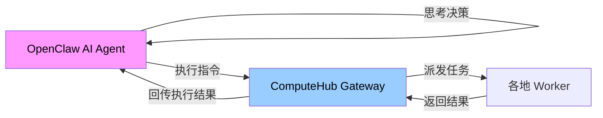
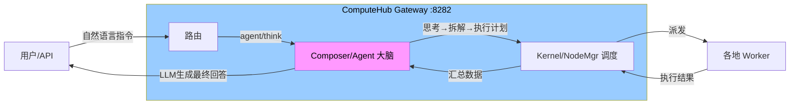

# ComputeHub 接入 AI 大脑 —— 植入方案

## 一、现状分析

### ComputeHub 当前架构
```
用户/API → Gateway (:8282) → Kernel/NodeMgr → Worker集群
                 │
                 └→ Composer (已初始化但未启用)
```

Gateway 目前是"任务转发器"——接收命令，找空节点，派发执行，收结果。没有自主决策能力。

### 已存在的 AI 基础设施（70% 已铺好）
| 组件 | 位置 | 状态 |
|------|------|:----:|
| LLM 客户端 (Chat/CallWithPrompt) | `src/composer/client.go` | **✅ 可用**，已适配 NewAPI content→reasoning fallback |
| TaskComposer (分解→分发→合并) | `src/composer/composer.go` | **✅ 完整实现**，`Run()` 方法完整 |
| LLM 任务拆分解器 | `composer.go` LLMDecomposer | ✅ 已实现 |
| LLM 结果合并器 | `composer.go` LLMCompositor | ✅ 已实现 |
| 并行分发引擎 | `composer.go` DispatchEngine | ✅ 含重试+指数退避 |
| Gateway 初始化 Composer | `gateway.go:200` | ✅ `composerObj = NewTaskComposer(...)` |
| config.json 配置读取 | `gatewaycmd/cmd.go` | ✅ 读取 api_url/api_key/model |
| LLM API key | TOOLS.md | ✅ 已有 NewAPI 配置 |

### 断点（缺的 30%）
1. **`handleTaskSubmit` 注释了 composer 调用** — 初始化了但不用
2. **config.json 指向本地 Ollama** — 不是 NewAPI
3. **没有 agent 循环** — 只能被动响应，不能自主思考

---

## 二、植入方案：三层递进

### 第一层 🟢 接上 Composer（预计 1 天）

**目标**: Gateway 提交任务时，自动用大模型拆解+分配+汇总。

#### 改动清单

**1.1 改 config.json**
```diff
- "api_url": "http://localhost:11434/v1",
- "api_key": "",
+ "api_url": "https://ai.zhangtuokeji.top:9090/v1",
+ "api_key": "sk-3RgMq1COL9uqn29hCBwXOt5X3d5TpIddaRKH44chQ2QcAybl",
- "model": "deepseek-v4-flash",
+ "model": "qwen3.6-35b-common",
- "execute_models": ["deepseek-v4-flash", "qwen3.6-35b", "llama3.1:8b"],
+ "execute_models": ["qwen3.6-35b-common"],
```

**1.2 取消注释 composer 调用**（gateway.go handleTaskSubmit）
```go
// 当前: 注释状态
// if g.Composer != nil {
//     // In a real scenario, complex tasks would be decomposed here
// }

// 改为:
if g.Composer != nil && !isSimpleTask(task) {
    go func() {
        result, err := g.Composer.Run(composer.TaskComposerInput{
            TaskID:       task.TaskID,
            OriginalTask: task.Command,
        })
        if err != nil {
            logWithTimestamp("[Composer] ❌ Decompose failed: %v", err)
        } else {
            logWithTimestamp("[Composer] ✅ %d subtasks → %d success, final=%d chars",
                len(result.Subtasks), countSuccess(result.Results), len(result.FinalResult))
        }
    }()
}
```

**1.3 简单命令走直接调度，复杂命令走 Composer**
- `ls`, `df -h`, `ping` 等 → 直接派发
- 自然语言指令（"分析这些日志""生成一份报告"）→ 走 Composer 拆解

**效果**: 
```
用户 POST "生成视频" → Gateway 用大模型拆解为:
  1. 读文档 (Worker A)
  2. 生成 TTS (Worker B)  
  3. 渲染视频 (Worker C)
→ 并行执行 → 合并结果
```

---

### 第二层 🟡 Agent 决策端点（预计 3 天）

**目标**: 新增 `/api/v1/agent/think`，接收自然语言指令，自主决策执行计划。

#### 新端点设计

```
POST /api/v1/agent/think
{
  "context": "用户问什么",
  "session_id": "保持对话连续性"
}
```

响应:
```json
{
  "thought": "用户想分析服务器日志，需要...",
  "plan": [
    {"step": 1, "action": "在Worker A上执行 grep ..."},
    {"step": 2, "action": "分析结果，用LLM生成报告"}
  ],
  "executed": true,
  "result": "最终输出"
}
```

#### 核心逻辑（AgentThink handler）

```
AgentThink {
  1. 调用 LLM(Chat) 分析上下文 → 生成执行计划（JSON格式）
  2. 遍历计划：
     - 如果是 shell 命令 → 创建 TaskSubmit → 派发到最佳 Worker
     - 如果是 LLM 分析 → 直接调用 NewAPI 做文本处理
  3. 汇总所有结果 → 调用 LLM 生成最终回答
  4. 返回结构化响应
}
```

**与 OpenClaw 的关系**:


**但现在我们直接在 Gateway 里植入脑细胞**:


---

### 第三层 🔴 自主运行（预计 1 周）

**目标**: Gateway 能像 OpenClaw 一样"醒来自己想想该做什么"。

#### 新增组件

**3.1 Agent 心跳决策**（类似 OpenClaw 的 heartbeat）
```
每 30 秒 Gateway 触发一次 agent heartbeat:
  1. 检查当前节点状态（有没有 Worker 空闲？）
  2. 检查任务队列（有没有卡住的任务？）
  3. 调用 LLM 判断："当前需要主动做什么？"
  4. 如果 LLM 认为需要行动 → 自动创建任务
```

**3.2 记忆/技能系统**
```
src/agent/
├── memory.go    # 对话记忆（类似 MEMORY.md）
├── skills.go    # 技能注册（类似 AGENTS.md skills）
├── brain.go     # 主循环（think→plan→act→learn）
└── brain_test.go
```

每个 skill 是一个结构化函数：
```go
type Skill struct {
    Name        string
    Description string
    Trigger     string  // 触发条件（LLM判断）
    Execute     func(ctx context.Context, args map[string]interface{}) (string, error)
}
```

**3.3 Gallery 接入 Brain**
作品广场接入后，Brain 可以：
- 新文件上传时自动识别内容 → 生成描述 → 更新索引
- 定期扫描 Gallery → 检查是否有待完成的视频任务
- 主动向老大汇报状态

---

## 三、文件改动清单

### 第 1 层（1天）
| 文件 | 改动 |
|------|------|
| `config.json` | api_url→NewAPI, api_key填入, model 换 qwen3.6 |
| `src/gateway/gateway.go` | handleTaskSubmit 取消注释 composer 调用 |
| `src/composer/composer.go` | 小优化：maxTokens 可配置 |
| 编译部署 | `build_all.sh` 重编译 |

### 第 2 层（3天）
| 文件 | 改动 |
|------|------|
| `src/agent/agent.go` | **新文件**: AgentThink handler + think 逻辑 |
| `src/agent/planner.go` | **新文件**: LLM plan 生成 |
| `src/gateway/gateway.go` | 注册 `/api/v1/agent/think` 路由 |
| `src/gatewaycmd/cmd.go` | optional: agent 配置读取 |

### 第 3 层（1周）
| 文件 | 改动 |
|------|------|
| `src/agent/brain.go` | **新文件**: 自主心跳决策循环 |
| `src/agent/memory.go` | **新文件**: 对话记忆 |
| `src/agent/skills.go` | **新文件**: 技能系统 |
| `src/agent/brain_loop.go` | **新文件**: 后台 goroutine |

---

## 四、风险和注意事项

| 风险 | 级别 | 应对 |
|------|:----:|------|
| LLM API 不稳定 | 🟡 | 超时 30s，失败 fallback 为直接调度 |
| NewAPI content 为空 | ✅ 已解决 | 已有 reasoning fallback |
| 每次请求多花几分钱 | 🟢 | 简单命令不走 AI，只有自然语言才走 |
| Worker 安全（无 TLS） | 🔴 | 独立问题，需另案解决 token 认证 |

---

## 五、路线图

```
Day 1 ──── 接上 Composer → Gateway 能智能拆任务
               ↓
Day 2-4 ── Agent/think 端点 → Gateway 能回答自然语言
               ↓
Day 5-7 ── Agent 循环 → Gateway 能自主干活、主动汇报
```

**第一层今天就能交付，老大你拍板了我直接开干。**
