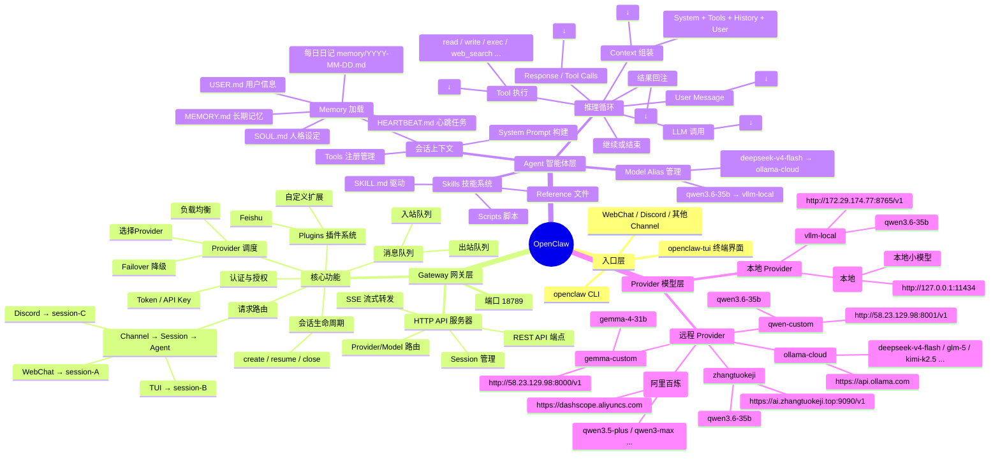
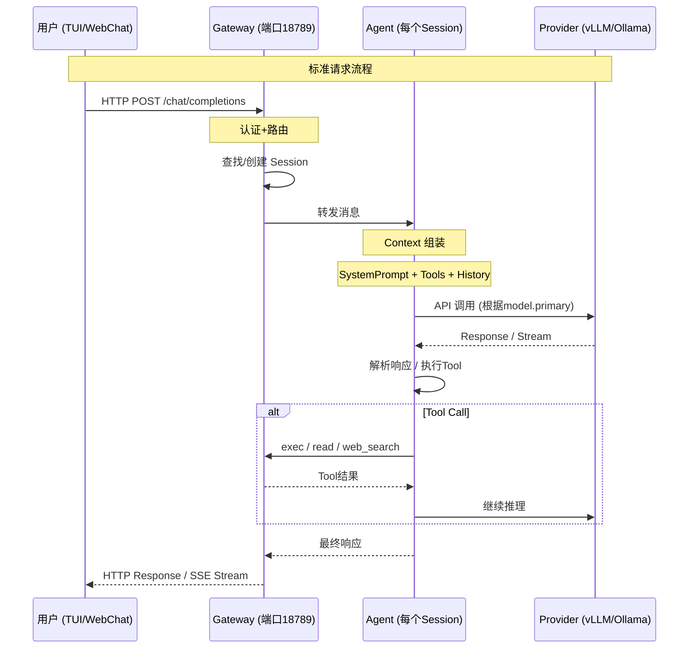
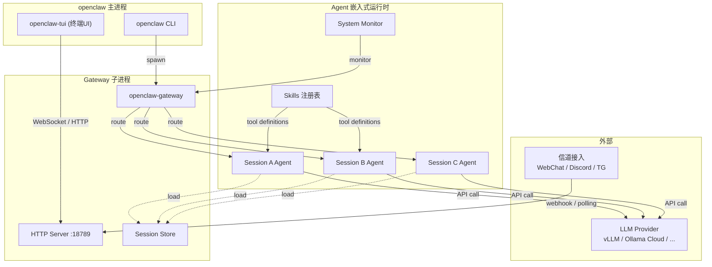

# OpenClaw Agent & Gateway 架构

## 数据流

## 进程架构

## 关键概念

| 概念 | 说明 |
|------|------|
| **Gateway** | 无状态 HTTP 网关，负责认证、路由、Session 生命周期管理 |
| **Agent** | 有状态的智能体运行时，负责对话上下文、Tool 执行、LLM 调用 |
| **Session** | 一个对话实例，包含完整历史。每个 Session 有一个 Agent |
| **Provider** | LLM 服务提供方，可以本地或远程 |
| **Channel** | 外部接入方式（WebChat、Discord、Telegram） |
| **Plugin** | 扩展功能，如飞书集成 |
| **Skill** | Agent 的能力包，含 SKILL.md + scripts + references |
