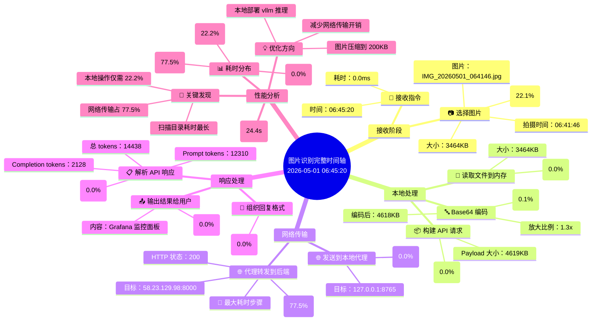
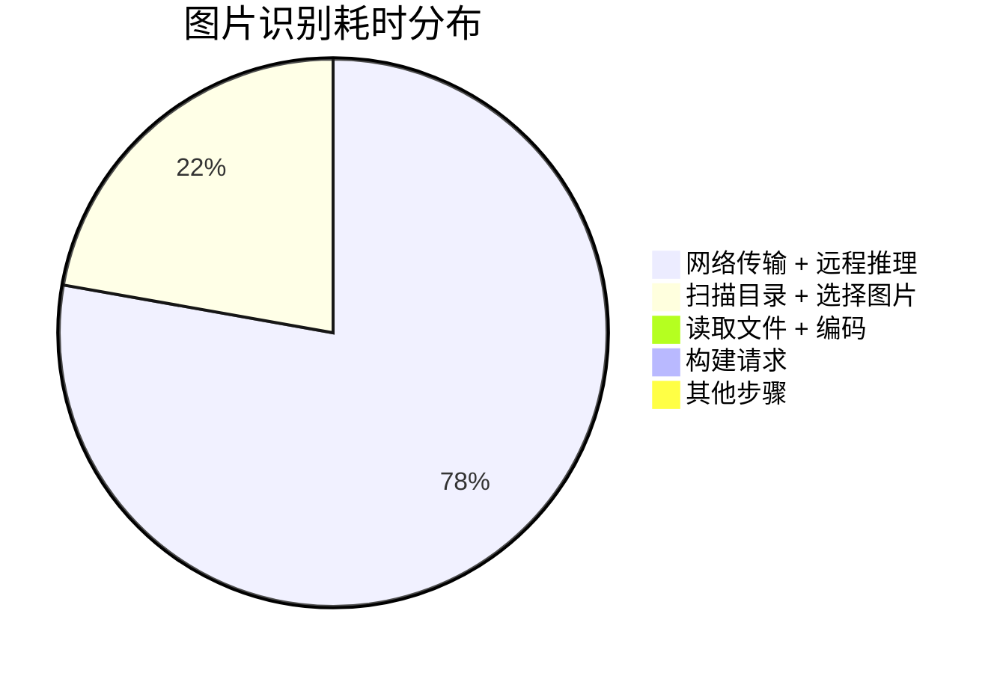
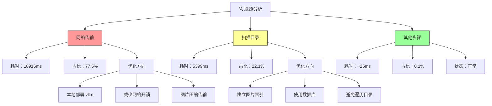
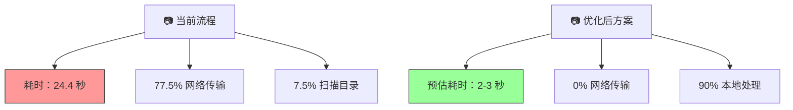
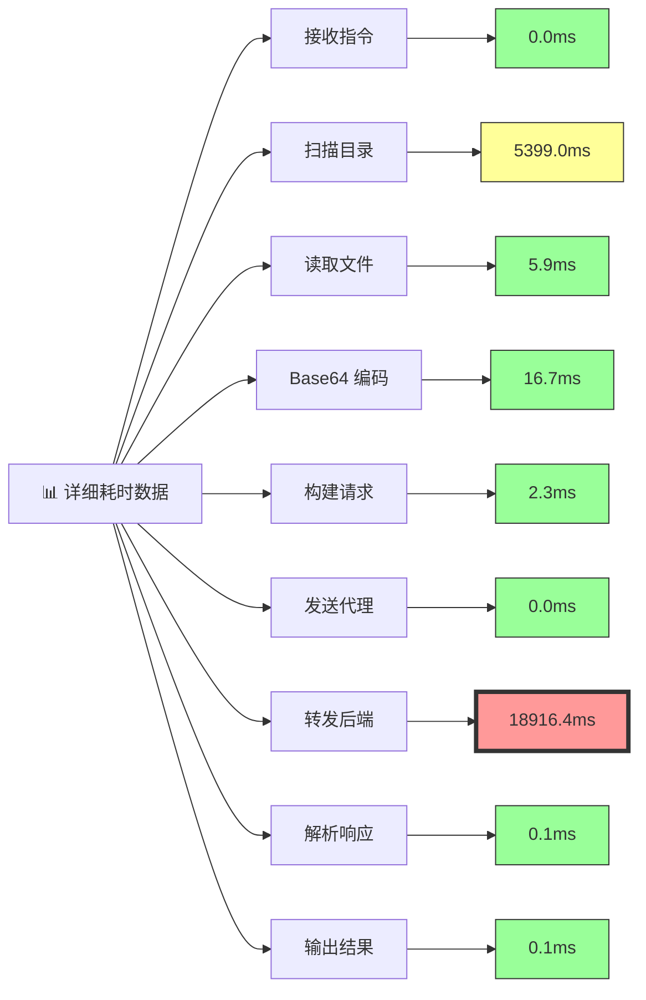
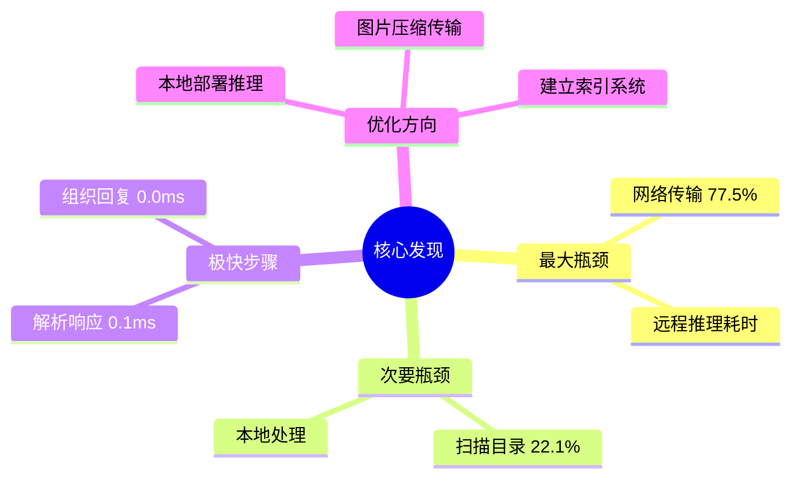

# 🕐 图片识别完整时间轴 - 思维导图

## 📊 图片识别测试时间轴（2026-05-01 06:45）

## 📈 各步骤耗时对比图

```mermaid
graph LR
    A[📨 接收指令<br/>0.0ms] --> B[🔍 扫描目录<br/>5399.0ms]
    B --> C[📂 读取文件<br/>5.9ms]
    C --> D[🔤 Base64 编码<br/>16.7ms]
    D --> E[📦 构建请求<br/>2.3ms]
    E --> F[🌐 本地代理<br/>0.0ms]
    F --> G[🌐 远程后端<br/>18916.4ms]
    G --> H[📋 解析响应<br/>0.1ms]
    H --> I[📝 组织回复<br/>0.0ms]
    I --> J[📤 输出结果<br/>0.1ms]
    
    style G fill:#f99,stroke:#333,stroke-width:4px
    style B fill:#ff9,stroke:#333
    style C fill:#9f9,stroke:#333
    style D fill:#9f9,stroke:#333
    style E fill:#9f9,stroke:#333
    style A fill:#9f9,stroke:#333
    style F fill:#9f9,stroke:#333
    style H fill:#9f9,stroke:#333
    style I fill:#9f9,stroke:#333
    style J fill:#9f9,stroke:#333
```

## 📊 耗时占比饼图

## 🎯 性能瓶颈分析

## 📊 优化前后对比

## 📋 详细数据表

---

## 💡 核心发现

---

**生成时间：** 2026-05-01 07:05  
**测试图片：** IMG_20260501_064146.jpg (Grafana 监控面板)  
**测试时间：** 2026-05-01 06:45:20 - 06:45:44 (24.4 秒)

> 💡 **提示：** 此文件使用 Mermaid 语法，可在支持 Mermaid 的 Markdown 编辑器中渲染为可视化图表。推荐使用 VS Code + Mermaid 插件查看。
