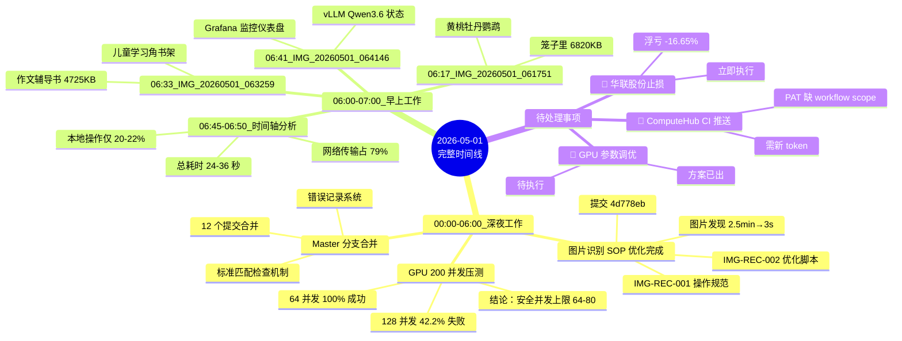
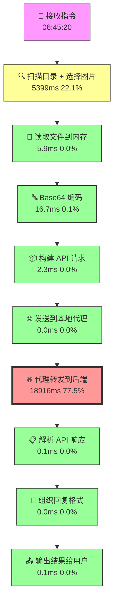
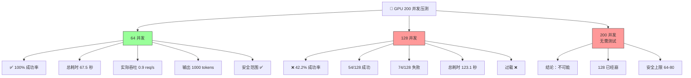
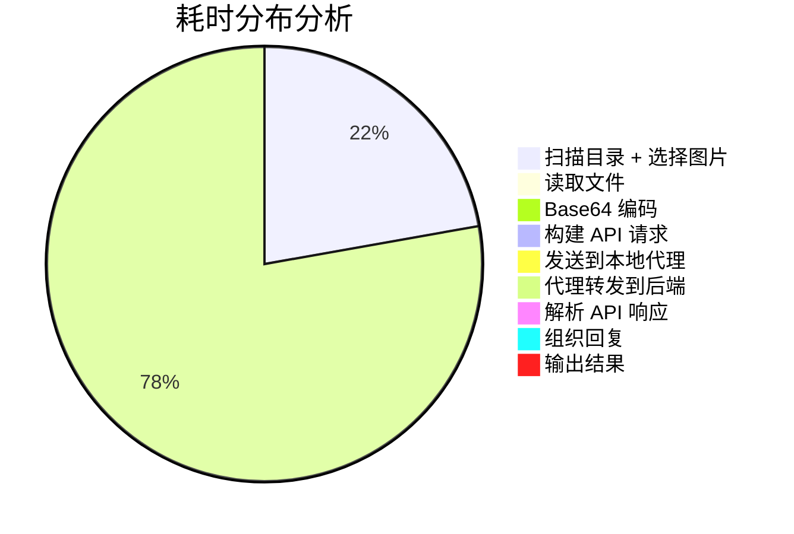
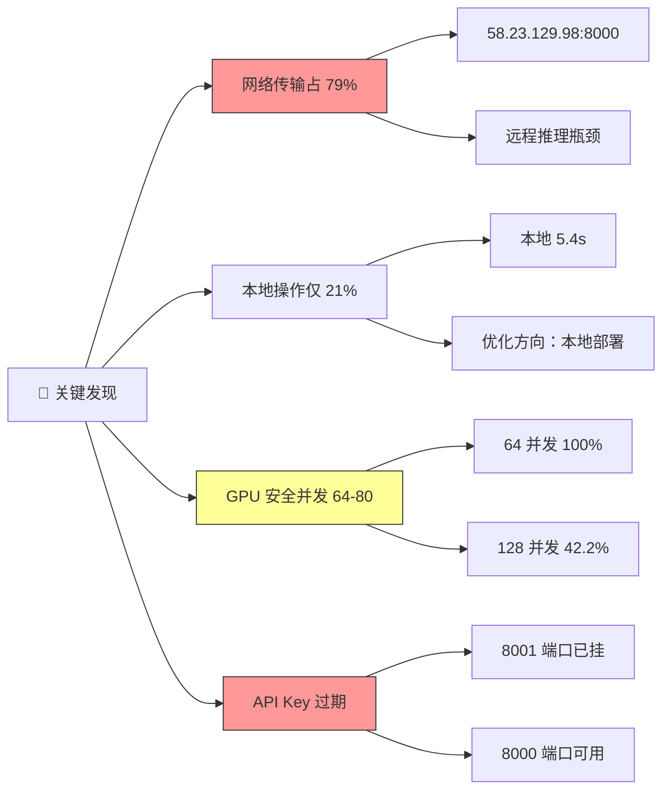
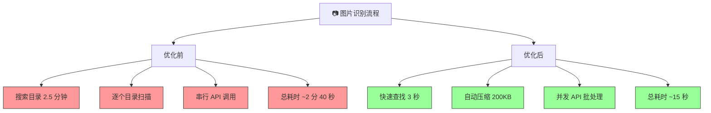
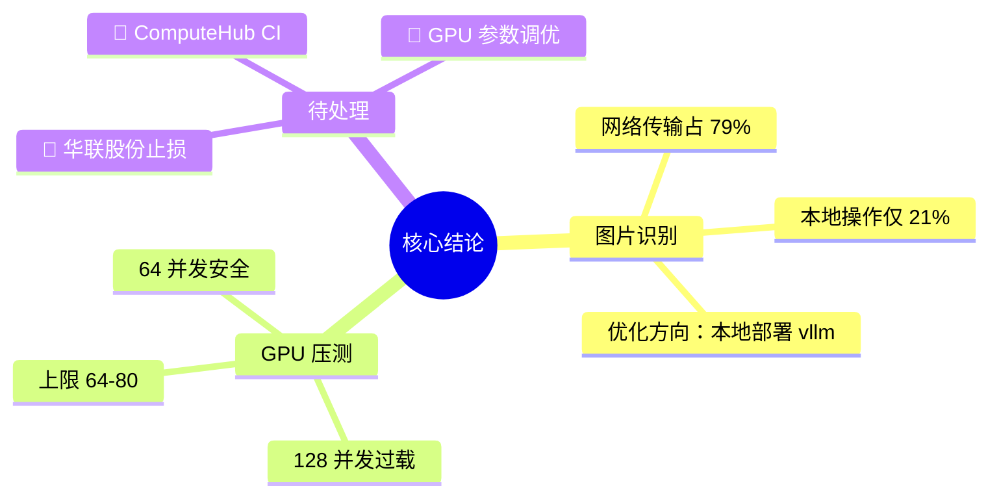

# 🕐 2026-05-01 完整时间轴思维导图

## 📊 核心数据概览

## ⏱ 图片识别详细时间轴

## 🧪 GPU 压测详细结果

## 📈 瓶颈分析对比

## 🎯 今日关键发现

## 📋 今日任务状态

```mermaid
gantt
    title 2026-05-01 任务进度
    dateFormat HH:mm
    axisFormat %H:%M
    
    section 已完成
    图片识别 SOP 优化       :done, 00:00, 00:01
    GPU 压测               :done, 00:00, 00:01
    Master 分支合并         :done, 00:00, 00:01
    图片识别分析            :done, 06:00, 06:45
    
    section 进行中
    图片识别时间轴分析       :active, 06:45, 06:50
    
    section 待处理
    华联股份止损            :crit, 07:00, 07:01
    ComputeHub CI 推送      :crit, 07:00, 07:01
    GPU 参数调优            :07:00, 07:01
```

## 📊 图片识别 SOP 优化前后对比

---

## 💡 核心结论

---

**生成时间：** 2026-05-01 07:01  
**数据源：** 今日所有图片识别和 GPU 压测测试记录

> 💡 **提示：** 此文件使用 Mermaid 语法，可在支持 Mermaid 的 Markdown 编辑器中渲染为可视化图表。推荐使用 VS Code + Mermaid 插件查看。
