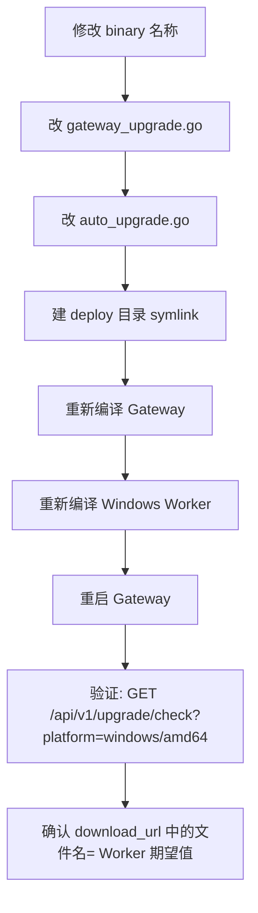

# WIN-BIN-001 Windows Worker 二进制命名一致性标准

> 版本: 1.0 | 制定: 2026-05-27 | 适用: ComputeHub Gateway + Worker 构建

## 背景

2026-05-27 Worker 自动升级失败：Gateway 返回 `computehub-worker-win-amd64.exe`，但旧 Worker 期望 `computehub-worker-amd64.exe`，平台校验不匹配导致升级进程退出。

## 核心规则

### 1. 二进制的名称必须**三处一致**

Windows amd64 worker binary 的名称，以下三处必须相同：

| 位置 | 文件 | 示例值 |
|------|------|--------|
| Gateway 路由 | `gateway/gateway_upgrade.go` → `upgradeBinaryName()` | `computehub-worker-amd64.exe` |
| Worker 升级 | `workercmd/auto_upgrade.go` → `workerExecutable()` | `computehub-worker-amd64.exe` |
| Deploy 目录 | `deploy/` 下的 symlink/文件 | `computehub-worker-amd64.exe` |

### 2. 命名约定表

| 平台 | 二进制文件名 |
|------|-------------|
| Windows amd64 | `computehub-worker-amd64.exe` |
| Windows arm64 | `computehub-worker-arm64.exe` |
| Linux amd64 | `computehub-worker-linux-amd64` |
| Linux arm64 | `computehub-worker-linux-arm64` |

⚠️ **注意**: Windows 不要加 `win-` 前缀！旧版 Worker (1.0.1) 的 `performUpgrade()` 有 `strings.Contains(URL, expectedBinary)` 校验，加了不匹配就直接报错。

### 3. 修改任何命名必须走的标准流程



### 4. 验证命令

```bash
# 验证 upgrade 检查返回的名称
curl -s "<GATEWAY_URL>/api/v1/upgrade/check?current_version=0.0.0&platform=windows/amd64" | jq .data.download_url
# 期望: "/api/v1/download?file=computehub-worker-amd64.exe"

# 验证 download 端点
curl -s -o /dev/null -w "%{http_code}" "<GATEWAY_URL>/api/v1/download?file=computehub-worker-amd64.exe"
# 期望: 200

# 验证 deploy 目录存在该文件/fork
ls -la $DEPLOY_DIR/computehub-worker-amd64.exe
```

## 错误案例（不要重犯）

| 错误 | 后果 | 发生时间 |
|------|------|----------|
| 命名改为 `computehub-worker-win-amd64.exe` | Worker 升级校验不通过→进程退出 | 2026-05-27 |

## 调试技巧

如果 Worker 升级失败，优先查看：
1. Worker 日志中 `平台不匹配` 错误
2. Worker 内部 `expectedBinary` 的值（`workerExecutable()` 返回）
3. Gateway 升级接口返回的 `download_url`
4. 两个值是否匹配

```go
// Worker 中的平台校验（auto_upgrade.go）
expectedBinary := workerExecutable()  // 例如 "computehub-worker-amd64.exe"
if !strings.Contains(resp.DownloadURL, expectedBinary) {
    return fmt.Errorf("平台不匹配: 期望 %s, 但 Gateway 返回 %s", ...)
}
```
