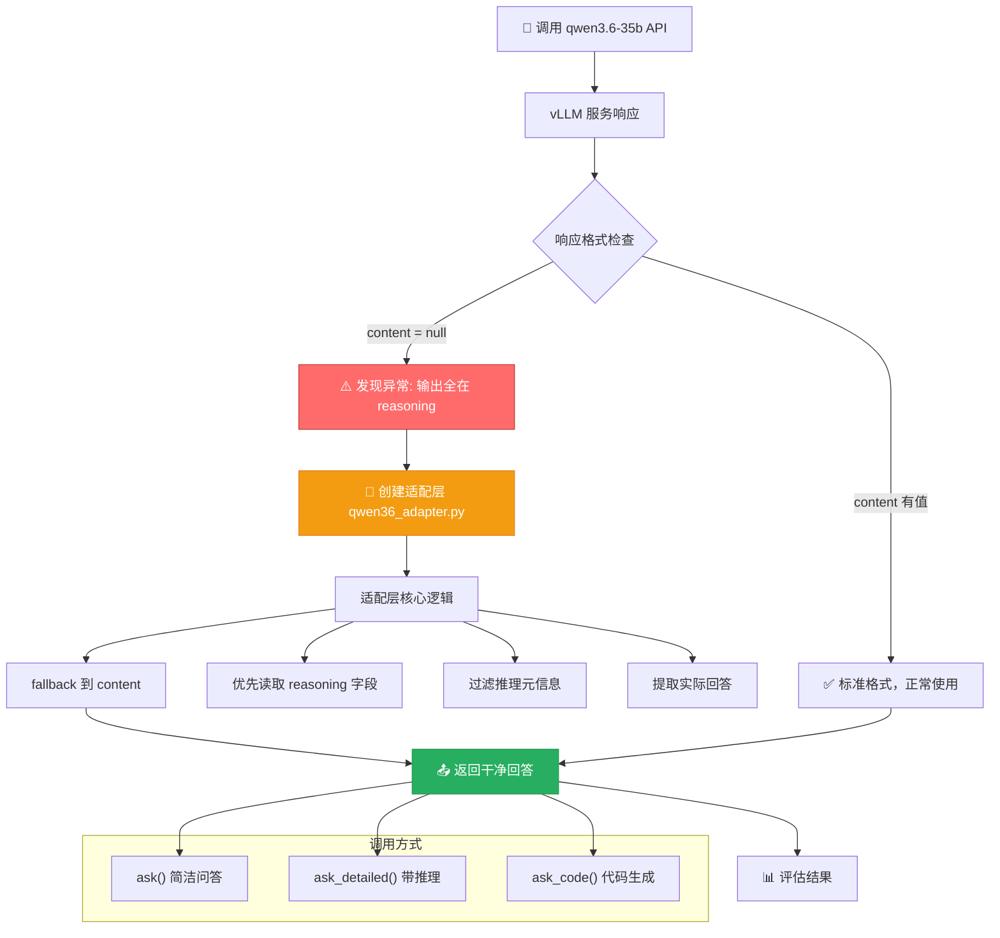

# qwen3.6-35b 适配全流程 — 流程图

## 一、整体适配架构流程图



## 二、测试迭代演进流程图

```mermaid
flowchart LR
    subgraph 发现问题
        A["16:15 首次测试"] --> B["发现 content 字段始终为 null"]
        B --> C["全部输出在 reasoning 字段"]
    end
    
    subgraph 修复阶段1
        C --> D["创建适配层 qwen36_adapter.py"]
        D --> E["18:20 测试 v3"]
        E --> F["35分 → 81分 🥇"]
        F -->|"content 优先策略"| G["核心突破"]
    end
    
    subgraph 修复阶段2
        G --> H["19:26 测试 v4"]
        H -->|"代码执行: exec→文件"| I["81分 → 86分 🥇 巅峰"]
    end
    
    subgraph 深入测试期
        I --> J["19:50 测试 v5 71%"]
        J --> K["19:57 测试 v6 57%"]
        K --> L["20:04 测试 v7 53%"]
        L --> M["20:09 测试 v8 68%"]
    end
    
    subgraph 全面回归
        M --> N["⚠️ 发现 adapter 提取缺陷"]
        N --> O["22:35 测试 v10"]
        O --> P["38/46 = 82.6% 🥈"]
    end
    
    P --> Q["📋 补写 adaptation-experience.md"]
    
    style B fill:#ff6b6b,stroke:#c0392b,color:#fff
    style F fill:#27ae60,stroke:#229954,color:#fff
    style I fill:#f1c40f,stroke:#f39c12,color:#333
    style P fill:#3498db,stroke:#2980b9,color:#fff
```



## 三、适配层处理流程（内部逻辑）

```mermaid
flowchart TD
    Start["收到 API 请求"] --> BuildMsg["构建 messages 数组"]
    BuildMsg --> CallAPI["POST /v1/chat/completions"]
    CallAPI --> Resp["收到 vLLM 响应"]
    
    Resp --> Parse{"解析响应"}
    Parse --> Content["msg.content"]
    Parse --> Reasoning["msg.reasoning"]
    
    Content --> C1{content 非空?}
    C1 -->|"✅ 有值"| Clean["直接返回 content"]
    C1 -->|"❌ null"| UseReasoning["使用 reasoning 字段"]
    
    UseReasoning --> Clean["执行 _clean_output()"]
    
    Clean --> Step1{"步骤1: 提取代码块"}
    Step1 -->|"找到 ```code```"| CodeBlock["返回代码块"]
    Step1 -->|"没找到"| Step2
    
    Step2{"步骤2: 找引号内容"}
    Step2 -->|"找到""xxx"""| Quotes["返回引号内内容"]
    Step2 -->|"没找到"| Step3
    
    Step3{"步骤3: Final Output"}
    Step3 -->|"找到"| FinalOut["返回 Final Output"]
    Step3 -->|"没找到"| Step4
    
    Step4{"步骤4: 最后一行"}
    Step4 -->["过滤 skip 关键词后返回"]
    
    CodeBlock --> End["📤 返回结果"]
    Quotes --> End
    FinalOut --> End
    
    style C1 fill:#e74c3c,stroke:#c0392b,color:#fff
    style Clean fill:#27ae60,stroke:#229954,color:#fff
```

## 四、从发现问题到知识沉淀的完整链路

```mermaid
flowchart TD
    subgraph 第1步：发现
        A1["新模型接入 qwen3.6-35b"] --> A2["调用 API 测试"]
        A2 --> A3["⚠️ 发现 content 始终为 null"]
    end
    
    subgraph 第2步：修复
        B1["分析原因: vLLM 非标准响应"] --> B2["设计适配方案"]
        B2 --> B3["实现 qwen36_adapter.py"]
        B3 --> B4["定义3个接口: ask/ask_detailed/ask_code"]
    end
    
    subgraph 第3步：验证
        C1["编写全面测试脚本"] --> C2["v3 测试 81分"]
        C2 --> C3["v4 测试 86分 巅峰"]
        C3 --> C4["v5-v8 深入测试"]
    end
    
    subgraph 第4步：发现问题
        D1["v5-v8 分数下降 53-71%"] --> D2["分析原因"]
        D2 --> D3["代码执行=环境问题"]
        D2 --> D4["adapter 输出提取=有缺陷"]
        D4 --> D5["7个失败项实际模型答了"]
    end
    
    subgraph 第5步：知识沉淀
        E1["编写适配文档"] --> E2["qwen36-35b-api-format-fix.md"]
        E1 --> E3["SOP.md 加规则"]
        E1 --> E4["MEMORY.md 记教训"]
        E1 --> E5["adaptation-experience.md 经验总结"]
        E1 --> E6["9份测试报告存档"]
    end
    
    A3 --> B1
    B4 --> C1
    C4 --> D1
    D5 --> E1
    
    style A3 fill:#ff6b6b,color:#fff
    style D3 fill:#f39c12,color:#fff
    style D5 fill:#e74c3c,color:#fff
    style E5 fill:#27ae60,color:#fff
```
