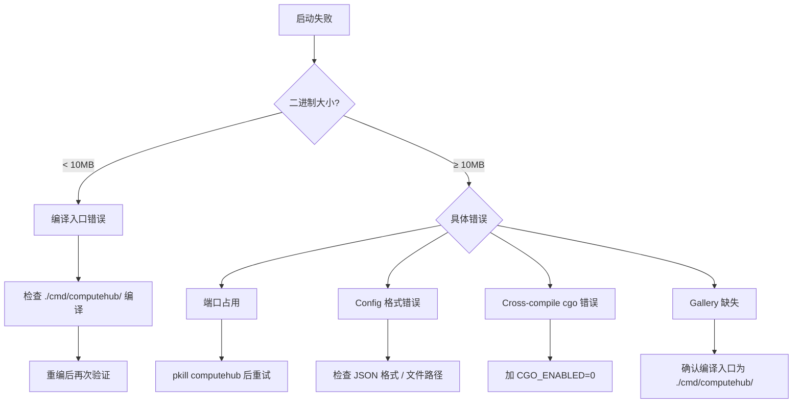

# ComputeHub 启动参数配置规范 (STD-CONFIG-001)

**生效**: 2026-05-17
**版本**: v1.1
**适用版本**: ComputeHub v0.7.10+
**编译入口**: `./cmd/computehub/`（三合一单二进制）

---

## 📋 规范总览

```
computehub（三合一二进制）
  ├─ gateway  服务端（核心），配置来源: CLI 标志 + config.json
  │   ├─ Gallery     ✓ 始终启用
  │   ├─ Visualizer  ✓ config.json 控制
  │   ├─ Dashboard   ✓ 始终启用
  │   ├─ Composer    ✓ config.json 控制
  │   └─ Video/DL/UP ✓ 始终启用
  │
  ├─ worker   代理端，配置来源: CLI 标志
  │   ├─ 注册 → 心跳 → 轮询 → 执行 → 回传
  │   └─ 自动检测 GPU/CPU/内存/IP
  │
  ├─ tui      管理端，配置来源: CLI 标志
  │   ├─ 仪表板/节点/GPU/地图/任务/告警/历史/健康
  │   └─ 仅连接已运行的 Gateway（不自启服务）
  │
  └─ version/help 信息查询
```

---

## 1. 编译规范

### 1.1 编译入口规则

| 用途 | 入口 | 包含功能 |
|------|------|----------|
| ✅ **生产部署** | `./cmd/computehub/` | gateway + worker + tui + version + help |
| ❌ 旧版单入口 | `./cmd/gateway/` | **仅 gateway**，无 Gallery / TUI / worker |
| ❌ 旧版单入口 | `./cmd/tui/` | 仅 TUI |
| ❌ 旧版单入口 | `./cmd/worker/` | 仅 Worker |

> **⚠️ 必须使用 `./cmd/computehub/` 编译**，其他入口已弃用。

### 1.2 编译命令规范

```bash
# ✅ 标准编译命令（始终加 CGO_ENABLED=0）
CGO_ENABLED=0 GOOS=linux GOARCH=amd64 \
  go build \
  -ldflags="-X github.com/computehub/opc/src/version.BUILD=$(date +%s)" \
  -o computehub \
  ./cmd/computehub/
```

| 参数 | 必选 | 说明 |
|------|------|------|
| `CGO_ENABLED=0` | ✅ | 禁用 CGO，避免交叉编译汇编错误 |
| `GOOS` | ✅ | 目标操作系统 |
| `GOARCH` | ✅ | 目标架构 |
| `-ldflags "-X ...BUILD=$(date +%s)"` | ✅ | 注入构建时间标识 |
| `-o computehub` | ✅ | 输出文件名 |
| `./cmd/computehub/` | ✅ | **三合一入口，固定** |

### 1.3 二进制验证清单

编译后运行 `computehub version` 验证：

```bash
# ✅ 输出示例
ComputeHub v0.7.9

# 快速检查 Gallery 是否编译进去
strings computehub | grep HandleGallery | wc -l
# 应 ≥ 1，否则是错误入口编译

# 检查子命令完整性
./computehub 2>&1 | head -5
# 应显示 gateway / worker / tui / version / help
```

---

## 2. GATEWAY 启动规范

### 2.1 启动命令

```bash
computehub gateway               # 默认端口 8282
computehub gateway --port 8282   # 显式指定端口（覆盖 config.json）
```

### 2.2 config.json 配置标准

配置文件查找顺序：`./config.json` → `~/config.json` → 自动创建 `~/config.json`

```jsonc
{
  "gateway": {
    "port": 8282,
    "max_connections": 100
  },
  "kernel": {
    "buffer_size": 100,
    "max_states": 1000
  },
  "executor": {
    "sandbox_path": "/tmp/computehub-sandbox"
  },
  "gene_store": {
    "path": "./genes.json"
  },
  "visualizer": {
    "enabled": true,      // false = 禁用可视化
    "simulate": false,     // true = 模拟数据（无真实节点测试用）
    "port": 8282
  },
  "composer": {
    "api_url": "",         // 空字符串 = 禁用 TaskComposer
    "api_key": "",
    "model": "",
    "execute_models": [],
    "max_concurrency": 8,
    "timeout_seconds": 120
  },
  "gallery": {
    "root_dir": "~/gallery"   // 支持 ~/ 家目录展开
  }
}
```

### 2.3 模块启用条件清单

| 模块 | 条件 | 启用日志标志 |
|------|------|-------------|
| **Composer** | `api_url` 非空 | `📝 Composer configured: model=...` |
| **Composer 禁用** | `api_url` 为空 | `⚠️ Composer not configured` |
| **Visualizer** | `enabled=true` | `🌍 Initializing Visualizer` |
| **Visualizer 模拟** | `simulate=true` | `🌍 Initializing Visualizer (simulate=true)` |
| **Gallery** | 始终启用 | `🎬 Gallery registered:` + 5 个子端点 |
| **Dashboard** | 始终启用 | `📂 Dashboard static files:` |
| **Video** | 始终启用 | `🎬 Video endpoints registered` |
| **Download** | 始终启用 | `📦 Download endpoint registered` |
| **Upgrade** | 始终启用 | `🔄 Upgrade endpoints registered` |
| **Prometheus** | 始终启用 | `📈 Prometheus /metrics endpoint registered` |

### 2.4 启动验证清单

| 检查项 | 正确日志 | 异常处理 |
|--------|----------|----------|
| Config 加载 | `✅ Config file loaded: config.json` | 无此日志时检查文件位置 |
| Prometheus | `✅ Prometheus metrics collector started` | — |
| Gateway 就绪 | `✅ Gateway initialized, ready to serve` | fatal 错误需排查 |
| Scheduler | `✅ Scheduler initialized with N real nodes` | 0 real nodes 正常表示等待 Worker 接入 |
| Gallery | `🎬 Gallery registered:` + 端点列表 | **无此日志 → 编译入口错误** |
| Visualizer | `🌐 Visualizer v2 API registered` | 无此日志时检查 `enabled` 配置 |
| Dashboard | `📂 Dashboard static files:` | — |
| 端口占用 | `Fatal Gateway Error: listen tcp :8282: bind: address already in use` | 先停旧进程 `pkill computehub` |

---

## 3. WORKER 启动规范

### 3.1 启动命令

```bash
# 最小启动（自动检测大部分参数）
computehub worker --gw http://192.168.1.17:8282

# 完整参数
computehub worker \
  --gw http://192.168.1.17:8282 \
  --node-id gpu-01 \
  --gpu-type H100 \
  --region cn-east \
  --ip 192.168.2.140 \
  --interval 3 \
  --heartbeat 30 \
  --concurrent 8
```

### 3.2 CLI 参数标准

| 参数 | 默认值 | 自动检测 | 说明 |
|------|--------|----------|------|
| `--gw` / `--gateway` | `http://localhost:8282` | 否 | Gateway 地址，必须手动指定 |
| `--node-id` / `--id` | `worker-<hostname>` | 是 | 为空则自动生成 |
| `--ip` / `--address` | `—` | 是 | 空则通过 UDP 8.8.8.8:80 检测 |
| `--gpu-type` / `--gpu` | `CPU` | 是 | 空则 `nvidia-smi` 检测，失败=CPU |
| `--region` | `cn-east` | 否 | 算力区域标识 |
| `--interval` / `--poll` | `5s` | 否 | 任务轮询间隔（秒） |
| `--heartbeat` | `25s` | 否 | 心跳上报间隔（秒） |
| `--concurrent` | `4` | 否 | 最大并发任务数 |

### 3.3 生命周期标准

```
┌──────────┐     ┌───────────┐     ┌─────────┐     ┌──────────┐     ┌──────────┐
│  REGISTER │ ──→ │ HEARTBEAT │ ──→ │ POLL    │ ──→ │ EXECUTE  │ ──→ │ RESULT   │
│ POST /reg │     │ POST /hrt │     │ POST /pl│     │ 本地运行 │     │ POST /res│
└──────────┘     └───────────┘     └─────────┘     └──────────┘     └──────────┘
                                                       │
                                                       ↓
                                                  ┌──────────┐
                                                  │ PROGRESS │ ← 可选，500ms 间隔
                                                  │ POST /prg│
                                                  └──────────┘

退出时：UNREGISTER → POST /api/v1/nodes/unregister
```

### 3.4 启动验证清单

| 检查项 | 正确输出 |
|--------|----------|
| Banner | `╔══════════════════════╗ ComputeHub Worker Agent v0.7.9` |
| 注册成功 | `✅ 节点已注册: gpu-01 (H100 | cn-east | 16c/32GB)` |
| 注册重试 | `💡 重试中...`（首次失败时自动每隔 10 秒重试） |
| 心跳 | 无错误日志 |
| 任务执行 | `📋 认领到任务: xxx` → `⚡ 执行任务:` → `✅ 完成` |
| 超时杀死 | `⚠️ 任务超时 %ds，正在终止...` |

---

## 4. TUI 启动规范

### 4.1 启动命令

```bash
computehub tui                        # 连接本地 Gateway (localhost:8282)
computehub tui --gw localhost:8282    # 同上一行
computehub tui --gw 192.168.1.17:8282 # 连接远程 Gateway
```

### 4.2 前置条件

> ⚠️ **TUI 不自启 Gateway**，必须先有 Gateway 在运行。

```
✅ Gateway 运行中 → TUI 正常启动
❌ Gateway 未运行 → TUI 报错：❌ 无法连接网关 http://localhost:8282
```

### 4.3 快捷键一览

| 快捷键 | 界面 | 功能描述 |
|--------|------|----------|
| `d` | Dashboard | KPI 卡片 + GPU分布 + 活跃节点 Top10 + 🔥 热 GPU Top5 |
| `n` | Nodes | 节点浏览器，支持按区域/状态/GPU过滤、增删改查 |
| `g` | GPU Monitor | GPU 按型号聚合统计 + 高温追踪 |
| `r` | Regions/Map | 全球算力 9 区域状态 + 健康度 |
| `t` | Tasks | 任务提交/取消/列表/实时输出跟踪 |
| `a` | Alerts | 告警按严重程度分类展示 |
| `h` | History | 5 项指标火花图 + 最新快照 |
| `health` | Health | 连通性/规模/资源利用率/总体评价 |
| `shell` | Shell | Legacy OPC-Shell 命令模式 |
| `?` | Help | 帮助信息 |

---

## 5. 版本号规范

```go
// src/version/version.go
const VERSION = "0.7.9"      // 手动设置，语义版本
var BUILD = "dev"             // ldflags 注入: $(date +%s)
```

| 字段 | 来源 | 说明 |
|------|------|------|
| `VERSION` | 代码常量 | 语义版本：fix→+0.0.1, feature→+0.1.0, major→+1.0.0 |
| `BUILD` | ldflags | 注入 Unix 时间戳，`"dev"` 表示本地开发 |

版本更新流程：
1. 修改 `src/version/version.go` 中 `VERSION` 常量
2. 重新编译
3. 更新 `STD-CONFIG-001` 中适用版本号
4. 更新 `docs/computehub-命令参数规范.md`

---

## 6. 启动配置速查表

```bash
# ─────────────────────────────────────────────────
# 场景 1：首次部署完整启动
# ─────────────────────────────────────────────────
# 1. 确保 config.json 已配置（Composer、Gallery 等）
# 2. 启动 Gateway
computehub gateway > gateway.log 2>&1 &
# 3. 验证 Gallery
curl http://localhost:8282/api/v1/gallery | head -5
# 4. 启动 Worker
computehub worker --gw http://localhost:8282 --node-id ubuntu-01 > worker.log 2>&1 &
# 5. 启动 TUI
computehub tui

# ─────────────────────────────────────────────────
# 场景 2：仅 Gateway 服务（Headless）
# ─────────────────────────────────────────────────
computehub gateway --port 8282

# ─────────────────────────────────────────────────
# 场景 3：仅 Worker 节点
# ─────────────────────────────────────────────────
computehub worker --gw http://192.168.1.17:8282 --node-id gpu-01 --gpu-type H100

# ─────────────────────────────────────────────────
# 场景 4：远程管理
# ─────────────────────────────────────────────────
computehub tui --gw 192.168.1.17:8282

# ─────────────────────────────────────────────────
# 场景 5：开发编译
# ─────────────────────────────────────────────────
CGO_ENABLED=0 go build -ldflags="-X ...BUILD=$(date +%s)" -o computehub ./cmd/computehub/
```

---

## 7. 故障排查流程



| 故障 | 现象 | 根因 | 解决 |
|------|------|------|------|
| Gallery 缺失 | 启动日志无 `🎬 Gallery registered` | 编译入口为 `./cmd/gateway/` 而非 `./cmd/computehub/` | 用三合一入口重编 |
| TUI 无子命令 | `./computehub tui` 按 gateway 启动 | 同上 | 同上 |
| 版本号不匹配 | 显示 v0.7.9 但无 Gallery | 版本号 ldflags 手动注入但代码不全 | 从源码重编 |
| cgo 错误 | `gcc_amd64.S: error: unknown token` | 交叉编译时 CGO 启用 | 加 `CGO_ENABLED=0` |
| 端口占用 | `bind: address already in use` | 旧实例未退出 | `pkill computehub` |
| Worker 注册失败 | `❌ 注册失败` | Gateway 未运行或地址错误 | 先启动 gateway，检查 `--gw` 地址 |
| TUI 连不上 | `❌ 无法连接网关` | Gateway 未运行 | 先启动 `computehub gateway` |
| Config 不生效 | 显示默认值 | config.json 不在当前目录或 ~/ | 检查文件位置和 JSON 格式 |

---

## 8. 标准执行流程 (SOP)

### 8.1 启动 Gateway

```bash
# Step 1: 检查端口占用
ss -tlnp | grep 8282 || echo "端口空闲"

# Step 2: 检查 config.json
test -f config.json || test -f ~/config.json || echo "⚠️ 无配置文件"

# Step 3: 启动
nohup computehub gateway > gateway.log 2>&1 &

# Step 4: 验证
sleep 2 && curl -s http://localhost:8282/api/health | grep -q '"status":"ok"'
echo $?  # 0=成功
```

### 8.2 启动 Worker

```bash
# Step 1: 确认 Gateway 可达
curl -s http://192.168.1.17:8282/api/health > /dev/null || exit 1

# Step 2: 启动
nohup computehub worker --gw http://192.168.1.17:8282 --node-id gpu-01 > worker.log 2>&1 &

# Step 3: 验证注册
curl -s http://192.168.1.17:8282/api/v2/nodes | grep -q "gpu-01"
echo $?  # 0=已注册
```

### 8.3 启动 TUI

```bash
# Step 1: 确认 Gateway 可达
curl -s http://localhost:8282/api/health > /dev/null || exit 1

# Step 2: 启动
computehub tui
```

---

> **版本历史**
> v1.0 (2026-05-16): 初始版本，整合 gateway/worker/tui 所有启动配置
