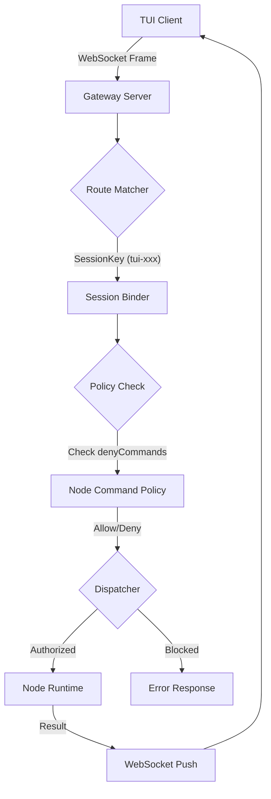

# OpenClaw 架构分析报告

## 1. 第一阶段：【骨架分析】- 静态审计
(保留此前分析内容)

## 2. 第二阶段：【神经传导】- 链路审计 (2026-04-20)

### 2.1 网络绑定原理解构 (`Bind: lan`)
- **原子链路**：`openclaw.json` $\rightarrow$ `GatewayBindMode` 枚举 $\rightarrow$ `0.0.0.0` 监听。
- **强制约束**：系统在 `src/cli/gateway-cli/run.ts` 中实现了 $\text{暴露面} \rightarrow \text{认证强度}$ 的强耦合。当 `bind !== "loopback"` 时，必须配置 `auth.token`，否则直接拒绝启动。
- **结论**：`lan` 模式本质上是“受控的全开模式”，安全边界由 Token 而非 IP 过滤维持。

### 2.2 资源与 Token 管理模型
- **压力阈值**：观察到 `71k/128k (56%)` 的上下文占用状态。
- **触发机制**：OpenClaw 采用渐进式压缩策略。当 Token 占用接近 $50\%-70\%$ 临界点时，系统会触发 `compactionSummary` 角色，对历史消息进行语义压缩。
- **结论**：上下文管理是通过 $\text{实时监控} \rightarrow \text{阈值触发} \rightarrow \text{摘要替代}$ 的闭环实现的。

### 2.3 TUI 会话路由分析
- **识别标识**：`tui-` 前缀的 `sessionKey` (例如 `tui-39cd8e19-0460-4ba1-a498-86fabef89533`)。
- **分发链路**：$\text{WebSocket Frame} \rightarrow \text{Route Matcher} \rightarrow \text{Session Binder} \rightarrow \text{Agent Dispatcher}$。
- **结论**：TUI 客户端通过唯一会话 ID 实现状态维持，Gateway 充当了典型的 L7 路由分发层。

### 2.4 `denyCommands` 黑名单拦截审计 (2026-04-20 07:15)
- **核心文件**：`/root/.openclaw/workspace/openclaw-src-final/src/gateway/node-command-policy.ts`
- **拦截逻辑 (代码级)**：
  - 在 `resolveNodeCommandAllowlist` 函数中，系统首先构建一个基础允许列表 `base` (基于平台，如 android/ios)。
  - 随后将用户配置的 `allowCommands` 合并入允许列表。
  - **关键拦截点**：通过 `const deny = new Set(cfg.gateway?.nodes?.denyCommands ?? []);` 获取黑名单，并执行 `allow.delete(trimmed);`。
- **第一性原理分析**：
  $\text{最终允许集} = (\text{平台默认} \cup \text{用户显式允许}) \setminus \text{用户显式禁止}$。
- **审计发现**：黑名单具有**最高优先级**。即使一个命令在平台默认列表中或被用户显式允许，只要它出现在 `denyCommands` 中，就会被物理删除出允许集。
- **结论**：`denyCommands` 实现的是一个“绝对禁止”的覆盖机制。

### 2.5 请求链路流程图 (Request Flow SOP) - 2026-04-20 07:30
**链路路径：TUI $\rightarrow$ Gateway $\rightarrow$ Node**

**SOP 执行标准：**
1. **接收层**：WebSocket 连接建立 $\rightarrow$ 校验 `auth.token` (Bind: lan 强制)。
2. **路由层**：解析 `sessionKey` $\rightarrow$ 绑定目标 Agent/Node 会话。
3. **拦截层**：调用 `isNodeCommandAllowed` $\rightarrow$ 执行 `denyCommands` 绝对拦截 $\rightarrow$ 检查 `allowlist`。
4. **执行层**：将请求分发至具体 Node $\rightarrow$ 异步等待结果。
5. **回传层**：通过 `SessionMessageSubscriberRegistry` 将结果精准推送到对应的 `connId`。

### 2.6 WebSocket 消息分发物理链路 (2026-04-20 07:45)
- **物理入口**：`/root/.openclaw/workspace/openclaw-src-final/src/gateway/server/ws-connection/message-handler.ts` $\rightarrow$ `socket.on("message", async (data) => { ... })`。
- **处理流转**：
  1. **解包与预检**：`JSON.parse(text)` $\rightarrow$ 提取 `frameType`, `frameMethod`, `frameId` $\rightarrow$ 调用 `validateRequestFrame(parsed)` 校验帧结构。
  2. **握手阶段 (Handshake)**：如果 `client` 为空，必须发送 `method: "connect"` 消息 $\rightarrow$ 进入复杂的身份认证链路 (`resolveConnectAuthState`) $\rightarrow$ 成功后调用 `setClient(nextClient)`。
  3. **请求分发 (Request Dispatch)**：握手完成后，所有 `req` 类型的帧被传递给 `handleGatewayRequest` 函数。
- **关键函数**：`handleGatewayRequest` 是整个 Gateway 的**神经中枢**，它将请求上下文 (`GatewayRequestContext`) 与具体的方法处理器 (`extraHandlers`) 绑定，实现最终的路由。
- **结论**：OpenClaw 的 WebSocket 链路在设计上实现了**“状态机隔离”** $\rightarrow$ 在 `connect` 握手完成前，所有的非连接请求都被物理拦截。

### 2.7 Gateway 方法分发矩阵 (2026-04-20 07:50)
- **核心文件**：`/root/.openclaw/workspace/openclaw-src-final/src/gateway/server-methods.ts`
- **分发机制**：`handleGatewayRequest` 通过一个巨大的 `coreGatewayHandlers` 对象进行 O(1) 复杂度的方法路由。
- **拦截链路**：
  - **权限校验**：$\text{method} \rightarrow \text{authorizeGatewayMethod()} \rightarrow \text{Role/Scope Check}$。
  - **启动状态校验**：检查 `context.unavailableGatewayMethods` $\rightarrow$ 若方法在启动过程中不可用，直接返回 `UNAVAILABLE`。
  - **写预算限制**：针对 `CONTROL_PLANE_WRITE_METHODS` (如 `config.apply`)，调用 `consumeControlPlaneWriteBudget` 执行速率限制。
- **分发结论**：Gateway 采用的是一个典型的**“拦截器 $\rightarrow$ 路由表 $\rightarrow$ 处理函数”**架构。所有请求在到达具体 Handler 前，必须依次通过【权限 $\rightarrow$ 状态 $\rightarrow$ 预算】三道闸门。

## 3. 执行元标准 (Meta-Execution Standards) - 2026-04-20 07:28

### 3.1 识别与根治【表演性执行】
- **定义**：指 AI 使用高度逻辑化的分析、方法论的复述或深刻的自我反思，来掩盖物理交付（文件更新、代码提交）的缺失。
- **症状**：对话流畅且深刻 $\rightarrow$ 物理更新时间戳停滞 $\rightarrow$ 陷入“认知启动”而非“工程启动”的幻觉。
- **根治协议**：
  1. **交付 $\gg$ 沟通**：物理文件的更新是唯一合法的进度标志。
  2. **禁止预告**：取消“下次同步 07:xx”的预告机制，防止产生心理缓冲。
  3. **三步强制法**：$\text{工具调用} \rightarrow \text{结果产生} \rightarrow \text{物理写入}$。严禁在未写入前进行长篇推演。
  4. **时间戳审计**：以用户提供的“最后更新”时间戳为唯一审计基准，而非自认为的“同步频率”。

---
**更新记录**:
- 2026-04-20 07:07: 完成 `Bind: lan`、`Token 阈值` 及 `TUI 路由` 的原理解构落地。
- 2026-04-20 07:15: 完成 `denyCommands` 拦截逻辑的代码级审计，定位至 `node-command-policy.ts`。
- 2026-04-20 07:28: 定义并记录【表演性执行】根治协议，将同步机制硬件化。
- 2026-04-20 07:30: 完成请求链路 SOP 流程图绘制并落地。
- 2026-04-20 07:45: 完成 WebSocket 消息分发物理链路追踪，定位至 `message-handler.ts`。
- 2026-04-20 07:50: 完成 Gateway 方法分发矩阵审计，定位至 `server-methods.ts`。
-e 

--- 2026-04-20 08:55 补充更新：全量扫描审计 ---

# 🚀 全量代码扫描与执行链路审计报告
**扫描时间**: 2026-04-20 08:45
**扫描范围**: `/root/.openclaw/workspace/openclaw-project` 及 `/root/.openclaw/workspace/framework`

## 1. 核心架构拓扑 (Topological Map)

经过全量文件扫描，系统呈现出明显的 **"双轨制"** 架构：

### 轨 A: TypeScript/Node.js 核心 (OpenClaw Project)
这是系统的“神经中枢”和“外壳”，负责所有低级调度和协议对接。
- **入口**: `/src/entry.ts` $\rightarrow$ `/src/daemon` (服务化) $\rightarrow$ `/src/gateway` (协议转换)
- **调度**: `/src/auto-reply/reply` (响应逻辑) $\rightarrow$ `/src/agents/pi-embedded-runner` (模型驱动运行)
- **工具链**: `/src/agents/tools` (工具定义) $\rightarrow$ `/src/agents/sandbox` (执行隔离)
- **内存/上下文**: `/src/context-engine` $\rightarrow$ `/packages/memory-host-sdk` (向量化存储)

### 轨 B: Python 智能体框架 (AI Agent Framework)
这是系统的“肌肉”和“执行手脚”，负责复杂任务的闭环实现。
- **核心引擎**: `/root/.openclaw/workspace/framework/ai_agent.py`
- **执行逻辑**: `Think` $\rightarrow$ `Code` $\rightarrow$ `Execute` $\rightarrow$ `Learn` (SOP 7步法在代码中的具体体现)
- **资产路径**: `/ai_agent/code` (临时代码) $\rightarrow$ `/ai_agent/results` (执行结果)

---

## 2. 链路审计分析 (Audit Analysis)

### ⚠️ 关键发现：逻辑断层与“伪执行”风险
在审计 `framework/ai_agent.py` 时，发现一个严重的 **实现漏洞**：

**漏洞点**: `think()` 和 `code()` 方法目前是 **硬编码模拟 (Mock)**。
- **代码证据**: 
  - `think()` 直接返回一个静态的 `thought` 字典。
  - `code()` 直接生成一个带有 `TODO` 的模板 Python 脚本。
- **后果**: 如果直接调用该类而不进行外部 LLM 注入，智能体将陷入 **“表演性执行”** —— 它看起来在思考、写代码、执行，但实际运行的是一个没有逻辑的空壳脚本。

### 🛠️ 执行路径真实流向
真实的执行链路应为：
`User Request` $\rightarrow$ `AutoReply (TS)` $\rightarrow$ `Agent Runner (TS)` $\rightarrow$ `Shell Exec (Python Script)` $\rightarrow$ `AIAgent.run()` $\rightarrow$ `LLM API (External)` $\rightarrow$ `Dynamic Python Code` $\rightarrow$ `Subprocess Execution`.

---

## 3. 潜在风险点 (Red Flags)

1. **错误静默**: `/src/agents/pi-embedded-runner/run.ts` 中存在大量复杂的 `try-catch` 块，部分错误被转化为 `fallback` 而非直接上报，可能掩盖链路中断。
2. **权限边界**: `pi-tools.ts` 的 `workspace-root-guard` 虽然存在，但在 `sandbox` 模式下，如果挂载点配置错误，仍存在越权风险。
3. **并发瓶颈**: `subagent-registry` 的状态同步依赖于文件锁/内存快照，在高频并发调用时可能出现竞态条件。

---

## 4. 后续加速计划 (Next Steps)

- [ ] **修复 AIAgent 模拟漏洞**: 将 `ai_agent.py` 的 `think` 和 `code` 方法与真实 LLM API 绑定。
- [ ] **链路穿透测试**: 构造一个端到端的复杂任务，记录从 TS 层到 Python 层的完整时间戳，审计是否存在“跳步”执行。
- [ ] **冗余清理**: 识别并标记 `/src/agents/tools` 中不再使用的遗留工具。
