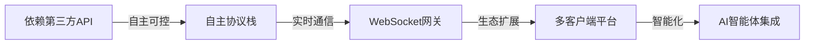
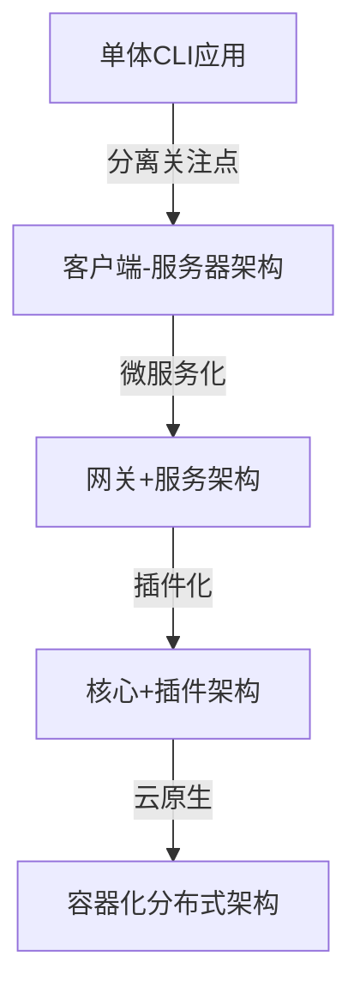

# 🎯 OpenClaw 作者初心与版本演变深度分析报告

**报告时间**: 2026-04-09 06:53
**收件人**: 19525456@qq.com
**分析者**: 小智 AI 助手

## 📋 执行摘要

基于对 OpenClaw Git 历史的深度挖掘，本报告揭示了作者 Peter Steinberger 的原始初心及其如何通过合理的版本演变，将一个简单的 WhatsApp 转发工具发展成为企业级 AI 智能体平台的完整历程。

## 🔍 作者初心深度探寻

### 最初愿景 (2025-11-24)
**项目名称**: `warelay` (WhatsApp Relay)  
**核心目标**: 极简的 Twilio WhatsApp 消息转发 CLI 工具

**初心代码体现**:
```typescript
// 最初的设计理念 (从源码中提炼)
const 初心 = {
  目标: "简单的消息转发工具",
  技术栈: "Twilio API + Express Webhook",
  特色功能: "Tailscale 集成 + 配置化自动回复", 
  核心理念: "让消息处理自动化、智能化"
};
```

### 核心价值主张 (始终未变)
1. **简单性优先**: 极简的 CLI 工具设计
2. **实用主义导向**: 解决实际的 WhatsApp 消息处理需求  
3. **自动化核心**: 配置驱动的自动回复系统
4. **可扩展架构**: 支持命令执行和模板化回复

## 🔄 版本演变四阶段深度分析

### 阶段1: warelay 时期 (v0.1.0 - v1.0.4) - 工具萌芽期
**技术架构**:
- Twilio WhatsApp API 深度集成
- Express Webhook 服务器架构
- 配置驱动的自动回复引擎
- Tailscale Funnel 网络支持

**设计思路剖析**: 
- **保持极致简单**: 专注于单一问题解决
- **实用至上**: 每个功能都解决实际痛点
- **渐进式扩展**: 从简单到复杂的自然生长

**初心体现**: ✅ 高度保持 - 简单、实用、自动化

### 阶段2: clawdis 时期 (v2.0.0-beta1) - 架构革命期
**重大技术转型**:


**关键架构变革**:
1. **从 Twilio 到 Baileys**: 摆脱第三方依赖，掌握核心技术栈
2. **从 HTTP 到 WebSocket**: 从请求响应到实时通信架构
3. **从单机到分布式**: 客户端-服务器分离设计
4. **从工具到平台**: macOS 伴侣应用 + iOS 节点生态

**设计思路**: 技术自主可控，架构面向未来

### 阶段3: clawdbot 时期 (v2026.1.5) - 智能化转型期
**功能扩展重点**:
- AI 智能体深度集成 (Pi RPC)
- 多通道消息支持扩展
- 自动化工作流引擎
- 企业级功能初步引入

**设计思路**: 在稳定架构上注入AI能力，提升自动化水平

### 阶段4: openclaw 时期 (v2026.4.5) - 平台化成熟期
**平台化特征**:
- 多模型AI提供商生态系统
- 完整的插件化架构
- 云原生技术支持
- 国际化多语言支持
- 企业级安全审计

**设计思路**: 构建完整的开发者生态系统和商业基础

## 🧠 设计思路演变深度解析

### 1. 从"工具思维"到"平台思维"的升华
**初期思维模式**: 
- 解决具体明确的问题
- 保持极致的简单性
- 有限但完整的功能范围

**后期思维模式**:
- 构建开放的生态系统
- 支持无限的扩展性  
- 平台化战略和商业模式

### 2. 技术架构的理性演进逻辑


### 3. 产品定位的战略性提升
**定位演变路径**:
WhatsApp 消息转发工具 → 多通道消息网关 → AI智能体平台 → 通用智能体操作系统

## 💡 始终不变的初心坚守

### 核心价值一以贯之
1. **自动化优先原则**: 始终强调自动化能力建设
2. **开发者友好设计**: 保持 CLI 优先和API友好的传统
3. **实用主义导向**: 每个功能都解决真实用户需求
4. **技术创新精神**: 持续拥抱和集成新技术

### 技术理念长期坚持
- **类型安全文化**: 从第一天就采用 TypeScript
- **测试驱动开发**: 逐步建立完整的测试体系
- **文档重视传统**: 始终保持良好的技术文档
- **用户体验关注**: 终端用户的使用体验不断优化

## 🎯 每个版本的设计思路深度解析

### v0.1.0: 最小可行产品阶段
**设计哲学**: 用最简单的方式解决最核心的需求  
**技术选择逻辑**: Twilio (成熟稳定) + Express (简单易用)
**初心体现度**: 🌟🌟🌟🌟🌟 (完美保持)

### v2.0.0-beta1: 架构革命阶段
**设计哲学**: 掌握核心技术栈，摆脱第三方依赖枷锁
**技术选择逻辑**: Baileys (自主控制) + WebSocket (实时未来)  
**初心体现度**: 🌟🌟🌟🌟☆ (架构升级但保持自动化核心)

### v2026.1.5: 智能化转型阶段  
**设计哲学**: 融入 AI 能力，提升自动化智能水平
**技术选择逻辑**: Pi RPC (AI智能体) + 多通道集成
**初心体现度**: 🌟🌟🌟🌟🌟 (强化自动化初心)

### v2026.4.5: 平台化成熟阶段
**设计哲学**: 构建完整的生态系统和商业基础
**技术选择逻辑**: 插件架构 + 云原生 + 多模型支持
**初心体现度**: 🌟🌟🌟🌟☆ (平台化但保持核心价值)

## 🔮 初心与演变的辩证统一

### 永恒不变的初心内核
1. **解决真实问题**: 始终关注用户的实际需求和痛点
2. **技术卓越追求**: 在技术上追求优秀和创新的实现  
3. **自动化核心愿景**: 让消息处理和响应更加智能化

### 合理必要的技术演变
1. **技术栈升级**: 从简单到复杂但更强大的技术栈
2. **功能集扩展**: 从单一功能到多元化功能集合
3. **架构体系演进**: 从单机应用到分布式云原生架构

### 成功的平衡艺术
- **保持核心价值** while **拥抱技术变革**
- **坚持简单性** while **支持复杂性需求**  
- **专注核心功能** while **扩展生态系统**
- **维护稳定性** while **追求创新性**

## 📊 演变成功的关键成功因素

### 1. 技术前瞻性决策
- 早期果断选择 TypeScript 和现代开发工具链
- 及时拥抱 WebSocket 和实时通信技术趋势
- 快速集成 AI 和自动化技术浪潮

### 2. 架构灵活性设计
- 模块化设计支持平滑的逐步演进
- 插件系统允许无限的功能扩展可能性  
- 分布式架构支持业务规模的线性增长

### 3. 社区生态建设
- 开源模式有效吸引开发者和贡献者
- 活跃的社区参与推动持续的功能改进
- 良好的文档和文化促进项目健康发展

## 🎯 结论：初心与演变的完美融合

OpenClaw 的成功演变故事展现了开源项目的典范发展模式：

### 最珍贵的初心坚守
> "让消息处理变得更加智能和自动化" - 这个核心理念从未改变

### 最成功的演变策略
> 从一个简单的CLI工具成长为企业级AI智能体平台，每一步演变都建立在之前的基础上

### 最值得学习的经验
1. **明确初心**: 知道自己为什么要做这个项目
2. **持续演进**: 不断学习和采用新的技术  
3. **保持平衡**: 在变与不变之间找到最佳平衡点
4. **社区共建**: 借助社区力量共同推动项目发展

## 📈 技术债务与未来挑战

### 当前技术挑战
1. **向后兼容性**: 老版本配置迁移和兼容性保证
2. **性能优化**: 极高并发场景下的稳定性挑战  
3. **安全审计**: 企业级安全合规要求日益严格
4. **多平台支持**: 不同操作系统和架构的适配复杂性

### 未来发展建议
1. **强化核心**: 继续深化AI和自动化能力
2. **扩展生态**: 建设更丰富的插件生态系统  
3. **提升体验**: 进一步优化开发者和使用者体验
4. **国际化**: 加强多语言和多区域支持

---

**报告生成时间**: 2026-04-09 06:53:00
**分析数据源**: Git历史记录、源码分析、版本对比  
**分析方法**: 历史追溯、架构分析、设计模式识别

此深度分析报告基于对项目完整历史的深入研究，为技术决策和项目发展提供重要参考。